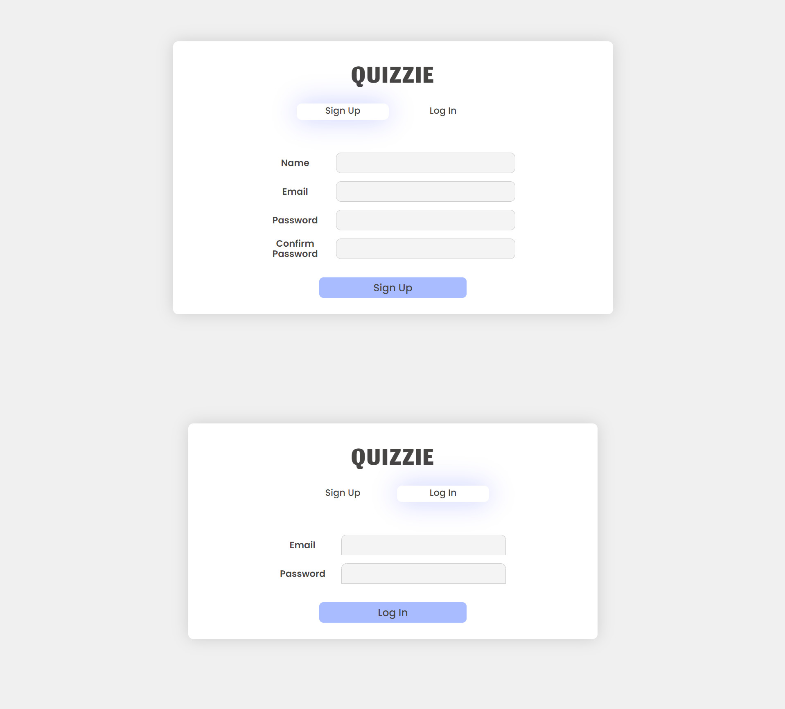
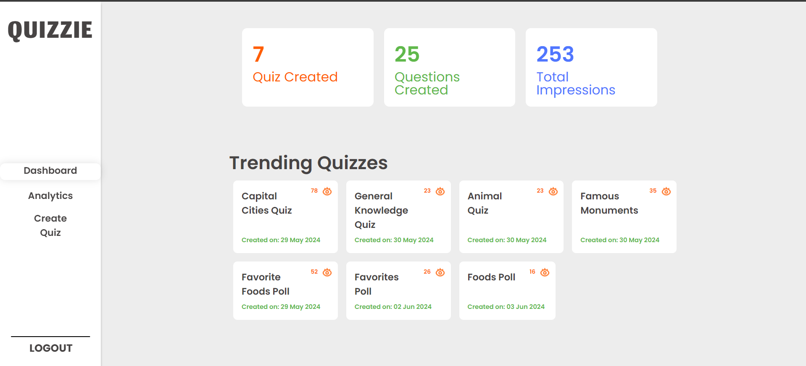
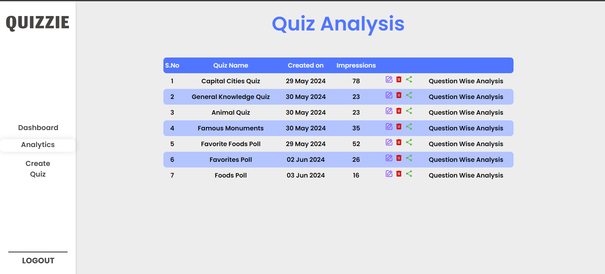
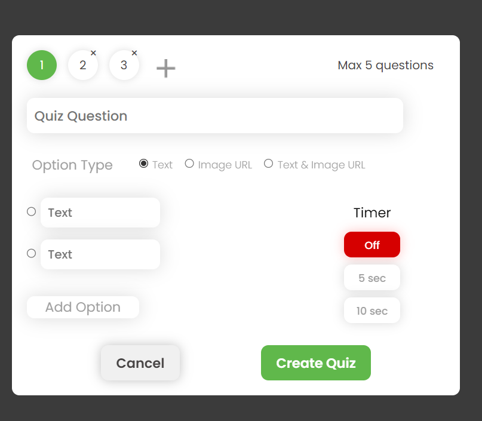
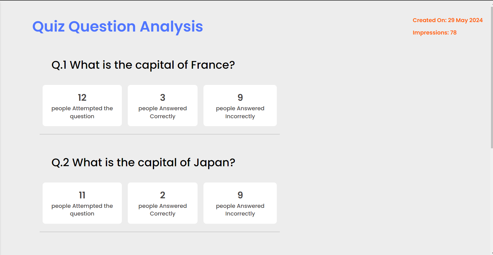

# Quizzie

Quizzie is a quiz management application designed to help users to create quizzes and share quiz efficiently, built using the MERN (MongoDB, Express.js, React, Node.js) stack. 
Users can create, update, delete, and share quizzes to others. The app also includes features for quiz management, quiz sharing, analytics.

# Features
1. **User Authentication**
2. **Quiz Management**
3. **Quiz Analytics and Sharing**
4. **Quiz and Poll creation**

# Technologies Used
Quizzie is built using the following technologies:

- Frontend: React
- Backend: Node.js, Express.js
- Database: MongoDB
- Authentication: JWT (JSON Web Tokens) for authentication and authorization.

# Installation
- Before getting started, ensure you have Node.js and npm installed on your machine.
## Clone the repository:
git clone https://github.com/yashwanth2000/quizzie.git
## Navigate to the project directory
cd quizzie

## Install the dependencies for both client and server:
- cd front-end: npm install (React Project installed through vite)
- cd back-end: npm install

## Set up the environment variables, Create a .env file in the root directory and add the following variables:
- VITE_SERVER_URL = "http://localhost:3000"
- MONGODB_URL = <your_mongodb_url>
- JWT_SECRET = <your_jwtkey>,
- VITE_SHARE_URL = http://localhost:5173

## Running the Application, start the client and server:
- In the client directory, run: npm run dev
- In the server directory, run: npm run dev

# Usage:
- Register a new user or log in with existing credentials.
- Only logged-in users can create quizzes.
- Create new quizzes using the create-quiz option:
   - Choose between Q&A Type or Poll Type.
   - Specify the quiz name and number of questions.
   - Questions can be in text only, image only, or a combination of text and image formats.
- Users can efficiently edit, delete, and manage quizzes.
- View quiz analytics to gain insights into quizzes created on the platform.
- Share quizzes with other users, attend quizzes, and receive results based on performance.
- To attend a quiz, click on "Share Icon" on the analytics page to copy the quiz link to your clipboard, then share or attend the quiz.

# Login and Register

# DashBoard Page

# Analytics Page

# Create Quiz Page

# Quiz Analysis

